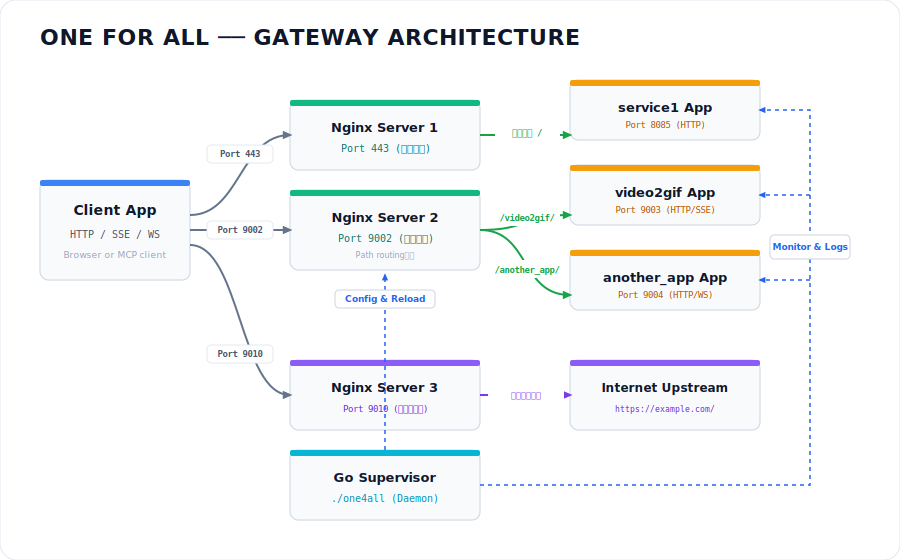
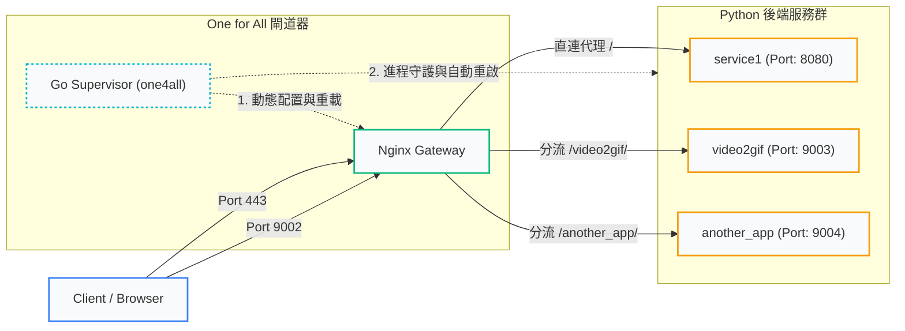

# One for All - Nginx Reverse Proxy & Go Supervisor Gateway

此專案為多個 Python/SSE/WebSocket MCP (Model Context Protocol) 服務的本地開發與部署閘道器 (Gateway)。
它統一對外提供單一的 Port 通訊，並利用 Nginx 進行路由分流，將不同 Path 的流量轉發至內部運行於不同 Port 的 Python 服務。

此專案已**全面移除 PM2 與 Node.js 的依賴**，改由原生編譯的 Go 二進位檔直接擔任輕量級進程守護器。

## 系統架構與流程圖





---


## 1. 支援的傳輸協定

* **HTTP / SSE (Server-Sent Events)** ── 對外統一由 Nginx 代理，底層配置了停用緩衝 (`proxy_buffering off`) 與大超時設定，保證 AI 模型上下文流式傳輸不受影響。
* **WebSocket** ── 透過 Nginx `map` 配置，支持在相同路由下動態將協議升級為 WebSocket，提供即時雙向通信。
* **傳統 HTTP REST API** (例如 `POST /convert`) ── 統一代理至相應的後端 Python 服務。

---

## 2. 專案架構與設定

本專案主要由以下核心檔案組成：

1. **[nginx.conf](file:///Users/lindav/git/one4all/nginx.conf)**：
   * Nginx 反向代理設定範本。該設定範本已被**直接嵌入編譯至 `one4all` 二進位執行檔中**。
2. **[one4all.json](file:///Users/lindav/git/one4all/one4all.json)**：
   * JSON 格式的設定檔。
   * **`nginx.port`**：您可以在此欄位自由決定 Nginx 對外的 Port。
   * **`services`**：定義內部 Python 服務的名稱、各自運行的 Port、工作目錄與啟動參數。
3. **[main.go](file:///Users/lindav/git/one4all/main.go)**：
   * 原生 Go 守護進程與 CLI 工具原始碼。
4. **[one4all](file:///Users/lindav/git/one4all/one4all)** (二進位執行檔，已被 `.gitignore` 排除)：
   * 本地開發控制 CLI。它會以 Goroutine 併發管理多個 Python 進程，並在子進程異常崩潰時**自動重啟**。

---

## 3. Nginx 部署與設定

### 建議的設定放置路徑
* **macOS (Homebrew)**:
  - Apple Silicon: `/opt/homebrew/etc/nginx/servers/one4all.conf`
  - Intel CPU: `/usr/local/etc/nginx/servers/one4all.conf`
* **Linux (Ubuntu/Debian)**:
  - `/etc/nginx/sites-available/one4all` (並軟連結至 `sites-enabled/`)

### 常用 Nginx 指令
* **測試設定檔語法**：
  - macOS: `nginx -t`
  - Linux: `sudo nginx -t`
* **重載設定（不中斷連線）**：
  - macOS: `nginx -s reload`
  - Linux: `sudo systemctl reload nginx`

---

## 4. CLI 常用操作指令

本專案無需安裝 PM2 與 Node.js，編譯後即可直接執行：

### 首次編譯
```bash
go build -o one4all main.go
```

### CLI 常用指令
* **在前台啟動守護進程**（會即時印出所有子服務的彙總日誌，並帶有時間戳記與服務名稱前綴）：
  ```bash
  ./one4all run
  ```
* **在背景啟動守護進程**（日誌會寫入至 `one4all_daemon.log`）：
  ```bash
  ./one4all start
  ```
* **查看守護進程與所管理的子服務狀態**：
  ```bash
  ./one4all status
  ```
* **一鍵重載服務與 Nginx**（會重新產生 Nginx 設定檔並 reload Nginx，同時發送 `SIGHUP` 訊號重啟所有 Python 子服務）：
  ```bash
  ./one4all reload
  ```
* **一鍵停止守護進程與所有子服務**（發送 `SIGTERM` 優雅關閉所有 Python 進程）：
  ```bash
  ./one4all stop
  ```
