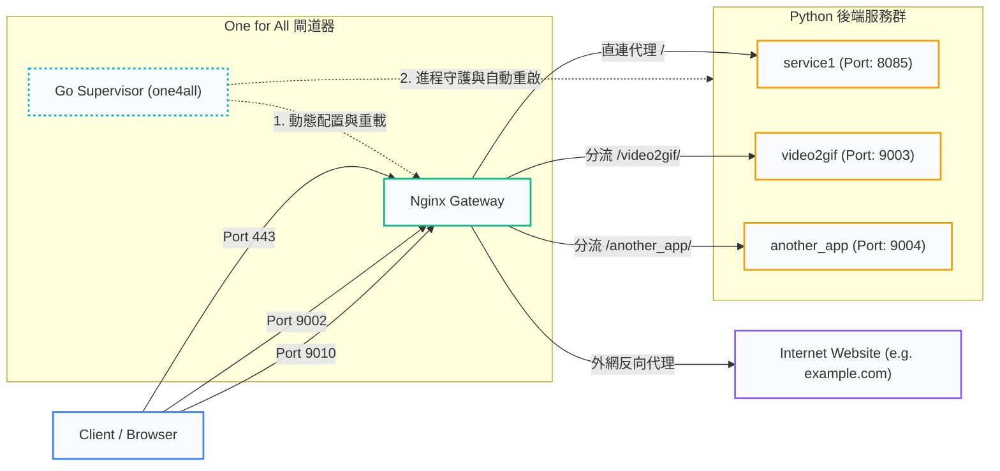

# One for All - Nginx Reverse Proxy & Go Supervisor Gateway

此專案為多個 Python/SSE/WebSocket MCP (Model Context Protocol) 服務的本地開發與部署閘道器 (Gateway)。
它對外提供多 Port 暴露與聲明式路由分流，並利用 Nginx 將流量轉發至內部運行於不同 Port 的 Python 服務。

此專案由原生編譯的 Go 二進位檔直接擔任輕量級進程守護器（Supervisor）。

---

## 系統架構與流程圖




---

## 1. 核心技術原理

本閘道器由 **Go Supervisor** 與 **Nginx Reverse Proxy** 兩大核心模組無縫協作，底層技術細節如下：

### A. Go 守護進程核心機制
* **進程生命週期監控 (Goroutines Supervisor)**：  
  當啟動 `run`/`start` 時，Go 主進程會為 [one4all.json](file:///Users/lindav/git/one4all/one4all.json) 中配置的每個服務拉起一個獨立的 Goroutine。透過 `os/exec` 監控子進程狀態，若子進程因異常或退出（Exit Code != 0），會在 **2 秒後自動重啟**。
* **Unix 信號熱重載 (SIGHUP Hot Reload)**：  
  主進程持續監聽 `syscall.SIGHUP` 訊號。當執行 `./one4all reload` 時，CLI 會向運行中的守護進程發送 `SIGHUP`。主進程接收到後，會**在不重啟自身的前提下**，停止目前所有運行的 Python 子進程、重新解析 JSON 設定檔，並拉起全新配置的子服務。
* **優雅終止與孤兒進程預防 (SIGINT / SIGTERM Sync)**：  
  當收到終止信號（如 `SIGINT`、`SIGTERM` 或 `./one4all stop`）時，Go 會捕獲該信號並啟動退場流程：優先對所有子服務發送 `SIGTERM` 訊號以利其釋放 Port 與資源，等待 1 秒後若未退出則強制發送 `SIGKILL`，最後刪除 PID 鎖定檔並乾淨退出，**徹底防範孤兒進程殘留**。
* **資訊解耦與參數動態注入 (`{{.Port}}` 佔位符)**：  
  Go 啟動子服務時，會自動解析 `args` 欄位。若發現 `{{.Port}}` 佔位符，會動態將其替換為實際的 `port` 數值。這實現了 Nginx 轉發埠與 Python 監聽埠的單一水源，杜絕手動修改帶來的 Port 不一致錯誤。
* **彙總日誌截獲 (Log Aggregation)**：  
  Go 透過管道（Pipe）捕獲所有子服務的 `stdout` 和 `stderr`，在行首動態加上時間戳記與服務標籤印出，實現日誌的統一檢視。
* **執行緒安全與併發保護 (Thread-Safety & Race Condition Prevention)**：  
  在多 Goroutine 併發拉起與監控子服務的架構下，引入 `sync.Mutex` 互斥鎖保護對執行中子進程狀態 Map 的存取與刪除，保證守護進程在高併發自癒重啟環境下 100% 穩定，免受 Concurrent Map Writes Panic 威脅。

### B. Nginx 聲明式動態渲染與協定優化
* **Go Text Template 模板引擎**：  
  Nginx 的配置範本定義在 [nginx.tmpl](file:///Users/lindav/git/one4all/nginx.tmpl) 中，並於編譯期被 `//go:embed` 直接嵌入二進位檔。Go 在執行 `reload` 時，會將 JSON 中的服務**依據對外 Port (`external_port`) 進行分組 (Grouping) 演算法**，為每個獨特的 Port 生成對應的 `server` 區塊與多個 `location` 路由，完全不需要人工編輯 Nginx 配置。
* **HTTP/SSE (Server-Sent Events) 優化**：  
  針對 AI 模型常用的 SSE 流式傳輸，配置中強制宣告了：
  - `proxy_buffering off;` ── 停用 Nginx 的回應緩衝，使後端的 SSE 數據包能零延遲推送給客戶端。
  - `proxy_read_timeout 86400s;` ── 將連線超時延長至 24 小時，防範 Nginx 自動切斷長連線。
* **WebSocket 動態協議升級**：  
  利用 Nginx 的 `map` 指令對 `$http_upgrade` 進行映射。當客戶端請求中帶有 `Upgrade: websocket` 標頭時，Nginx 會動態向後端發送 `Connection: upgrade`，實現 HTTP、SSE 與 WS 協定在同一個 Location 路由下的無縫相容。
* **API 路由重新對應與映射 (Route Rewriting / Sub-path Mapping)**：  
  支援在同一個伺服器區塊下透過 `extra_paths` 將特定路徑（如 `/convert`）重新對應並精確轉發至後端服務的特定 API 子路徑，提供靈活的 Gateway 路由轉發。
* **特大傳輸限制優化 (Large Payload Handling)**：  
  在生成的每個 Location 區塊中，默認配置 `client_max_body_size 50M;`，允許流暢傳輸特大號多媒體檔案（如 video2gif 轉碼所需之大型 MP4 影片），避開 Nginx 默認 1MB 的上傳限制。

---

## 2. 專案目錄與核心檔案

* **[main.go](file:///Users/lindav/git/one4all/main.go)**：原生 Go 守護進程與 CLI 工具原始碼。
* **[nginx.tmpl](file:///Users/lindav/git/one4all/nginx.tmpl)**：Nginx 配置的 Go Template 範本檔。
* **[one4all.json](file:///Users/lindav/git/one4all/one4all.json)**：宣告式服務與反向代理路由設定檔。
* **[.gitignore](file:///Users/lindav/git/one4all/.gitignore)**：排除平台編譯產物 `one4all`、背景日誌 `*.log` 與系統暫存檔。

---

## 3. 環境準備與首次編譯

### macOS (Apple Silicon 或 Intel)
1. **安裝 Nginx**：
   ```bash
   brew install nginx
   ```
2. **安裝 Go 環境** (若要自行編譯)：
   ```bash
   brew install go
   ```

### Linux (Ubuntu / Debian)
1. **安裝 Nginx**：
   ```bash
   sudo apt update && sudo apt install -y nginx
   ```
2. **安裝 Go**：
   ```bash
   sudo apt install -y golang
   ```

### 首次編譯
在專案根目錄下，執行以下指令編譯出您該作業系統平台專屬的二進位執行檔：
```bash
go build -o one4all main.go
```
*編譯完成後，會於目錄下生成一個零外部環境依賴、微秒級啟動的 `one4all` 可執行檔。*

---

## 4. CLI 使用與操作說明

| 指令 | 執行模式 | 核心行為 | 背景訊號/機制 |
| :--- | :--- | :--- | :--- |
| **`./one4all run`** | 前台 (Foreground) | 啟動守護進程並管理所有服務。即時將所有子服務日誌彙總輸出至螢幕。 | 常駐前台，接收 `Ctrl+C` 時發送 `SIGTERM` 關閉所有子服務。 |
| **`./one4all start`** | 背景 (Daemon) | 在背景啟動守護進程。所有子服務與守護進程日誌將非同步寫入至 `one4all_daemon.log`。 | 定向輸出，產生 `one4all.pid` 鎖定檔。 |
| **`./one4all status`** | 查詢 | 檢測守護進程是否存活，並印出當前守護的主進程 PID、所管理之子服務清單及其代理拓撲。 | 讀取 PID 檔，向該 PID 發送 `0` 號訊號檢測進程生命狀態。 |
| **`./one4all reload`** | 熱重載 | 1. 讀取 JSON 並渲染生成 Nginx 設定檔。<br>2. 執行 `nginx -t` 語法測試與 `nginx -s reload`。<br>3. 通知運行中的 Go 守護進程重新載入配置並重啟所有 Python 子服務。 | 向 `one4all.pid` 中的進程發送 `SIGHUP` 訊號。 |
| **`./one4all stop`** | 停止 | 終止背景運行的 Go 守護進程，並確保其安全、優雅地關閉所有由其管理的子服務。 | 向 `one4all.pid` 傳送 `SIGTERM` 訊號，並循環等待其安全退場。 |

---

## 5. 宣告式路由配置範例 (如何彈性擴展)

所有的路由分流、Port 暴露、Python 服務啟動參數均在 [one4all.json](file:///Users/lindav/git/one4all/one4all.json) 中進行配置。

### 範例：新增直連代理與路徑分流
假設您要新增以下兩個服務：
1. **`my_api` 服務** ── 運行在 Port `8081`。希望 Nginx 額外監聽 **`80`** 埠並**直連代理**（即 `http://127.0.0.1:80/` ➜ `8081`）。
2. **`image_mcp` 服務** ── 運行在 Port `9007`。希望 Nginx 在原先對外的 **`9002`** 埠下，新增一個**分流路徑** `/image/`（即 `http://127.0.0.1:9002/image/` ➜ `9007`）。

您**不需要修改 Nginx 設定檔**，只需在 [one4all.json](file:///Users/lindav/git/one4all/one4all.json) 中的 `services` 陣列加入以下宣告：

```json
{
  "nginx": {
    "config_name": "one4all.conf"
  },
  "services": [
    // 1. 原有的 service1, video2gif, another_app 保留...
    
    // 2. 新增的 my_api 直連服務
    {
      "name": "my_api",
      "port": 8081,
      "script": "main.py",
      "cwd": "/path/to/my_api",
      "interpreter": "python3",
      "args": "--port {{.Port}}",
      "proxy": {
        "type": "direct",
        "external_port": 80
      }
    },
    // 3. 新增的 image_mcp 分流服務
    {
      "name": "image_mcp",
      "port": 9007,
      "script": "app.py",
      "cwd": "./services/image_mcp",
      "interpreter": "python3",
      "args": "--port {{.Port}}",
      "proxy": {
        "type": "path",
        "external_port": 9002,
        "path": "/image/"
      }
    }
  ]
}
```

修改完成後，在終端機中執行：
```bash
./one4all reload
```
Go 會自動將配置渲染並重載，完成部署！

---

## 6. 排錯與常見問題 (Troubleshooting)

#### 1. 執行 `./one4all reload` 時出現 `Permission denied`？
* **原因**：Nginx 配置了小於 `1024` 的特權埠（如 `443` 或 `80`），普通用戶無權限綁定。
* **解法**：請以 `sudo` 權限執行重載指令：
  ```bash
  sudo ./one4all reload
  ```
  *(在 macOS 上，Homebrew Nginx 通常可以免 sudo 執行高於 1024 的 Port，如需跑在 80 或 443 亦需提升權限。)*

#### 2. Nginx 對外連線出現 `502 Bad Gateway`？
* **原因**：Nginx 已成功監聽，但無法與內部的 Python 服務通訊。
* **解法**：
  1. 執行 `./one4all status` 確認該 Python 服務目前是否處於啟動狀態。
  2. 檢查 `one4all_daemon.log`，確認該 Python 服務啟動時是否因代碼語法錯誤或缺少依賴套件而崩潰。
  3. 驗證服務의 `port` 參數是否與 Python 啟動的監聽 Port 一致。
